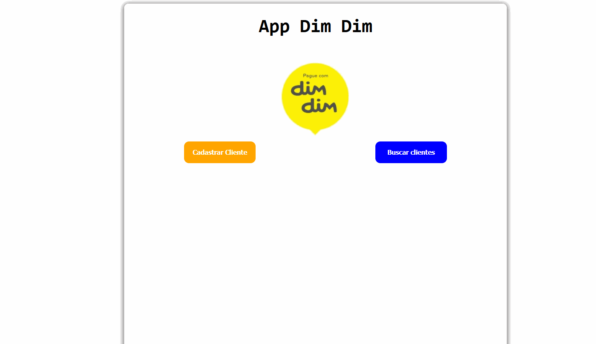

# Projeto feito CP-Devops do 2º ano da FIAP.

Criação de um pagina web para realizar a consulta dos  end points para a disciplina de devops apos o deploy do projeto, na Azure.

### Developers: 
* [Marcos Vinicius Ferreira](https://github.com/marcosnaofazisso) || RM: 86904
* [Cristine Acocella](https://github.com/cristineacocella) || RM 88251
* [Jonathan Felix](https://github.com/jhowfelix) || RM: 88082
* [Priscila Nastacio](https://github.com/PriscilaNastacio) || RM: 88849
* [Marcos Maciel](https://github.com/Marcos26-tech) || RM: 88267

# Demo

# Tutorial
npm install
npm install --save styled-components

#Como rodar o projeto 
npm start

## Thank you!

